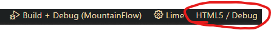

MountainFlow
==========

Successor to <https://github.com/HenryFBP/LithicRivers>

# Setup

<https://haxeflixel.com/documentation/getting-started/>
<https://haxeflixel.com/documentation/install-haxeflixel/>
<https://haxe.org/download/>

Run these one at a time. Some need your input.

    haxelib install lime
    haxelib install openfl
    haxelib install flixel
    haxelib install hxcpp-debug-server

    haxelib run lime setup flixel
    haxelib run lime setup

    haxelib install flixel-tools
    haxelib run flixel-tools setup

    haxelib update flixel # (To update)

# Developing

Read <https://haxeflixel.com/documentation/visual-studio-code/>

# Running

Run > "Run and Debug" in VSCode.

Make sure to change the target:

I recommend "Windows/Debug". This is the only setting I've found that works with VSCode breakpoints.

Or,

    lime test html5
    lime test neko
    lime test flash

# Issues

## `64bit is not automatically supported for this version of VC. Set HXCPP_MSVC_CUSTOM and manually configure the executable, library and include paths`

You need MSVC... <https://community.haxe.org/t/how-to-fix-error-set-hxcpp-msvc-custom-manually/2934>

SPECIFICALLY:

- MSVC v143
- Windows SDK (10.x)
- Windows Universal CRT SDK

<https://code.visualstudio.com/docs/cpp/config-msvc>

